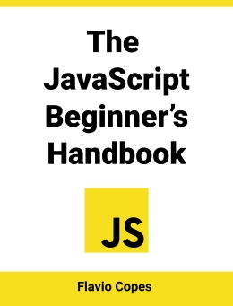

  <b>A tutorial in my <a href="https://github.com/abeerration/CS-Self-Education">CS Self Education</a> series</b>
  <h1>JS Node Express MongoDB Tutorial</h1>
  &nbsp;&nbsp;
  &nbsp;&nbsp;
  &nbsp;&nbsp;
  &nbsp;&nbsp;

---

## Prerequisites

None

## Description & Goals

This tutorial is about learning JavaScript, Node.js, Express.js and MongoDB to create a simple web app.

---

## Materials

| # | Cover | Title |
| ----------- | ----------- | ----------- |
| **1.** |  | <h4><i>Flavio Copes</i></h4><h2>The JavaScript Beginner's Handbook</h2>
https://flaviocopes.com/access

https://www.freecodecamp.org/news/the-complete-javascript-handbook-f26b2c71719c

2020
 |
| **2.** |  | <h4><i>Nathan Sebhastian</i></h4><h2>Node.js Web Development For Beginners</h2>
<i>A Step-By-Step Guide to Build an MVC Web Application With Node.js, Express, and MongoDB</i>
https://codewithnathan.com
2024
 |
